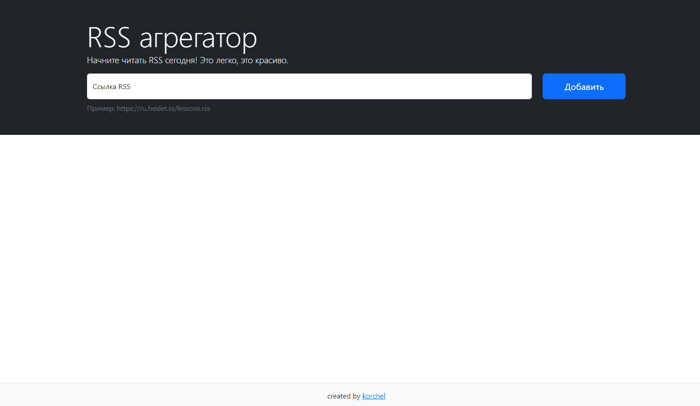

### RSS Aggregator
_____

RSS Aggregator is a web application that allows you to follow content from online newspapers, blogs, etc. by aggregating and updating posts from different feeds. All you need is to provide an RSS link of a feed of your interest.

[https://frontend-project-11-red.vercel.app/](https://frontend-project-11-red.vercel.app/)

### Hexlet tests and linter status:

### Github Actions

### Code Climate
